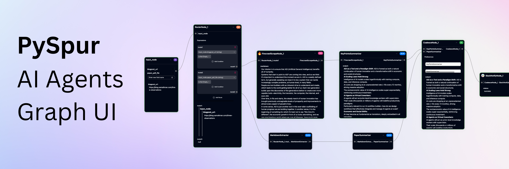

<p align="center"><strong>PySpur est un créateur d'agents d'IA en Python. Les ingénieurs en IA l'utilisent pour créer des agents, les exécuter étape par étape et inspecter les exécutions passées.</strong></p>

<p align="center">
  <a href="./README.md"></a>
  <a href="./README_CN.md"></a>
  <a href="./README_JA.md"></a>
  <a href="./README_KR.md"></a>
  <a href="./README_DE.md"></a>
  <a href="./README_FR.md"></a>
  <a href="./README_ES.md"></a>
</p>

<p align="center">
<a href="https://docs.pyspur.dev/" target="_blank">
  
</a>
<a href="https://calendly.com/d/cnf9-57m-bv3/pyspur-founders" target="_blank">
  
</a>
<a href="https://forms.gle/5wHRctedMpgfNGah7" target="_blank">
  
</a>
<a href="https://discord.gg/7Spn7C8A5F">
  
</a>
</p>

https://github.com/user-attachments/assets/1ebf78c9-94b2-468d-bbbb-566311df16fe

# 🕸️ Pourquoi PySpur ?

- ✅ **Piloté par les tests** : Construisez des workflows, exécutez des cas de test et itérez.
- 👤 **Humain dans la boucle** : Workflows persistants qui attendent l'approbation ou le rejet humain.
- 🔄 **Boucles** : Appels d'outils itératifs avec mémoire.
- 📤 **Téléversement de fichiers** : Téléchargez des fichiers ou collez des URL pour traiter des documents.
- 📋 **Sorties structurées** : Éditeur d'interface utilisateur pour les schémas JSON.
- 🗃️ **RAG** : Analyser, découper, intégrer et insérer ou mettre à jour des données dans une base de données vectorielle.
- 🖼️ **Multimodal** : Support pour vidéos, images, audio, textes, code.
- 🧰 **Outils** : Slack, Firecrawl.dev, Google Sheets, GitHub, et plus encore.
- 🧪 **Évaluations** : Évaluez les agents sur des ensembles de données réelles.
- 🚀 **Déploiement en un clic** : Publiez en tant qu'API et intégrez-le où vous le souhaitez.
- 🐍 **Basé sur Python** : Ajoutez de nouveaux nœuds en créant un seul fichier Python.
- 🎛️ **Support multi-fournisseurs** : >100 fournisseurs de LLM, intégrateurs et bases de données vectorielles.

# ⚡ Démarrage rapide

C'est la manière la plus rapide de commencer. Python 3.11 ou une version supérieure est requis.

1. **Installer PySpur :**
    ```sh
    pip install pyspur
    ```

2. **Initialiser un nouveau projet :**
    ```sh
    pyspur init my-project
    cd my-project
    ```
    Cela va créer un nouveau répertoire avec un fichier `.env`.

3. **Démarrer le serveur :**
    ```sh
    pyspur serve --sqlite
    ```
    Par défaut, cela démarrera l'application PySpur sur `http://localhost:6080` en utilisant une base de données SQLite.
    Nous vous recommandons de configurer une URL d'instance Postgres dans le fichier `.env` pour une expérience plus stable.

4. **[Optionnel] Configurer votre environnement et ajouter des clés API :**
    - **Via l'interface de l'application** : Naviguez vers l'onglet des clés API pour ajouter des clés de fournisseurs (OpenAI, Anthropic, etc.)
    - **Configuration manuelle** : Éditez le fichier `.env` (recommandé : configurez postgres) et redémarrez avec `pyspur serve`

C'est tout ! Cliquez sur « New Spur » pour créer un workflow, ou commencez avec l'un des modèles de base.

# ✨ Avantages principaux

## Points d'arrêt avec humain dans la boucle :

Ces points d'arrêt mettent en pause le flux de travail lorsqu'ils sont atteints et le reprennent dès qu'un humain l'approuve.
Ils permettent une supervision humaine pour les flux de travail nécessitant une assurance qualité : vérifiez les sorties critiques avant que le flux de travail ne continue.

https://github.com/user-attachments/assets/98cb2b4e-207c-4d97-965b-4fee47c94ce8

## Déboguer au niveau des nœuds :

https://github.com/user-attachments/assets/6e82ad25-2a46-4c50-b030-415ea9994690

## Multimodal (téléverser des fichiers ou coller des URL)

PDF, vidéos, audio, images, ...

https://github.com/user-attachments/assets/83ed9a22-1ec1-4d86-9dd6-5d945588fd0b

## Boucles


## RAG

### Étape 1) Créer une collection de documents (découpage + analyse)

https://github.com/user-attachments/assets/c77723b1-c076-4a64-a01d-6d6677e9c60e

### Étape 2) Créer un index vectoriel (intégration + insertion/mise à jour dans la base de données vectorielle)

https://github.com/user-attachments/assets/50e5c711-dd01-4d92-bb23-181a1c5bba25

## Blocs modulaires

https://github.com/user-attachments/assets/6442f0ad-86d8-43d9-aa70-e5c01e55e876

## Évaluer la performance finale

https://github.com/user-attachments/assets/4dc2abc3-c6e6-4d6d-a5c3-787d518de7ae

## Bientôt : Auto-amélioration

https://github.com/user-attachments/assets/5bef7a16-ef9f-4650-b385-4ea70fa54c8a

# 🛠️ Configuration de développement de PySpur
#### [ Instructions pour le développement sur des systèmes de type Unix. Le développement sur Windows/PC n'est pas supporté ]

Pour le développement, suivez ces étapes :

1. **Cloner le dépôt :**
    ```sh
    git clone https://github.com/PySpur-com/pyspur.git
    cd pyspur
    ```

2. **Lancer en utilisant docker-compose.dev.yml :**
    ```sh
    docker compose -f docker-compose.dev.yml up --build -d
    ```
    Cela démarrera une instance locale de PySpur avec le rechargement à chaud activé pour le développement.

3. **Personnaliser votre configuration :**
    Modifiez le fichier `.env` pour configurer votre environnement. Par défaut, PySpur utilise une base de données PostgreSQL locale. Pour utiliser une base de données externe, modifiez les variables `POSTGRES_*` dans le fichier `.env`.

# ⭐ Soutenez-nous

Vous pouvez nous soutenir en laissant une étoile ! Merci !


Vos retours seront grandement appréciés.
Veuillez nous [faire part](mailto:founders@pyspur.dev?subject=Feature%20Request&body=I%20want%20this%20feature%3Ai) des fonctionnalités de cette liste que vous souhaitez voir prochainement ou proposer de toutes nouvelles fonctionnalités.