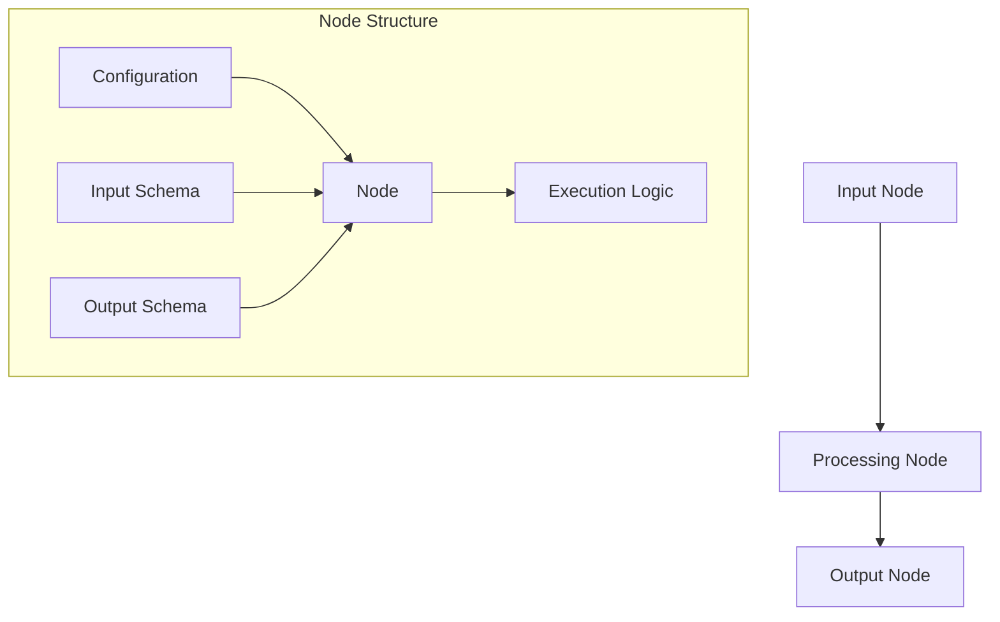
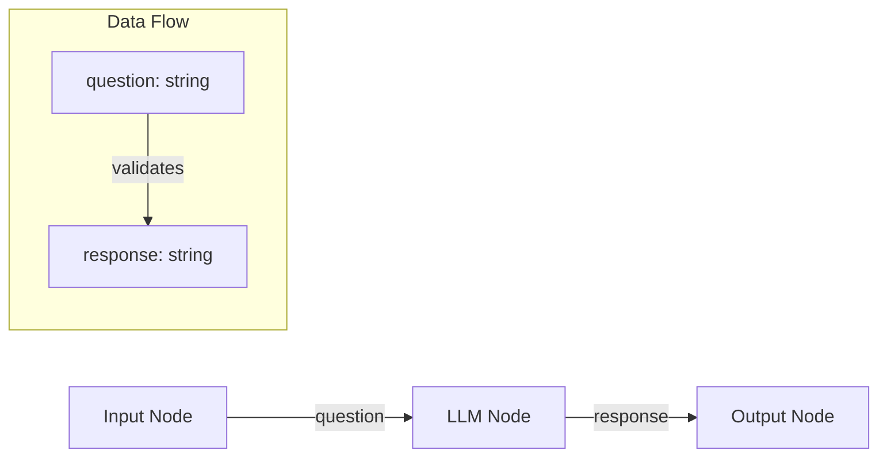
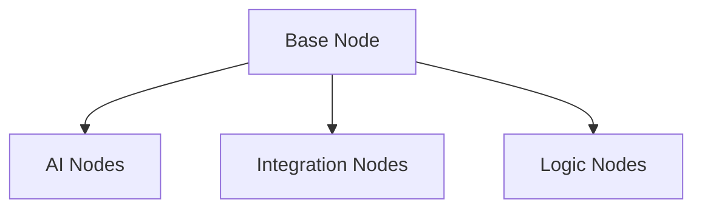

import { Callout } from 'nextra/components'

## What are Nodes?

Nodes are typed functions that serve as the building blocks of workflows and agent tools. Each node is a self-contained unit that:
- Has a defined schema for inputs and outputs
- Performs a specific task or operation
- Can be connected to other nodes in a workflow
- Can be used as tools by agents

### Visual Overview



## Using Nodes in Your Project

### As Workflow Components

Nodes can be connected together to create workflows. The workflow executor handles:
- Type validation between connected nodes
- Dependency resolution and execution order
- Data flow between nodes



```python
# Example of nodes in a workflow
workflow = WorkflowDefinitionSchema(
    nodes=[
        {
            "id": "input_node",
            "title": "User Input",
            "node_type": "InputNode",
            "config": {"output_schema": {"question": "string"}}
        },
        {
            "id": "llm_node",
            "title": "LLM Processing",
            "node_type": "SingleLLMCallNode",
            "config": {
                "system_message": "You are a helpful assistant.",
                "user_message": "{{ question }}"
            }
        }
    ],
    links=[
        {
            "source_id": "input_node",
            "target_id": "llm_node"
        }
    ]
)
```

### As Agent Tools

Nodes can be used directly by agents as tools. Each node:
- Has built-in parameter validation
- Returns structured outputs
- Can access configured integrations

## Node Components

### Configuration

Each node has a configuration class that defines its behavior:

```python
class SlackNotifyNodeConfig(BaseNodeConfig):
    channel: str = Field("", description="The channel ID to send the message to.")
    message: str = Field(
        default="",
        description="The message template to send to Slack."
    )
```

### Input/Output Schema

Nodes use Pydantic models to define their input and output schemas:

```python
class SlackNotifyNodeInput(BaseNodeInput):
    message: str
    channel: str

class SlackNotifyNodeOutput(BaseNodeOutput):
    status: str
```

### Execution

The node's core logic is implemented in its `run` method:

```python
async def run(self, input: BaseModel) -> BaseModel:
    # Node implementation
    result = await self.process(input)
    return self.output_model.model_validate(result)
```

## Node Types and Examples

### Core Node Types



### 1. AI Nodes

AI nodes handle interactions with language models and other AI services. Located in `@llm` directory.

```python
@NodeRegistry.register(category="LLM")
class SingleLLMCallNode(BaseNode):
    name = "single_llm_call_node"

    async def run(self, input: BaseModel) -> BaseModel:
        messages = create_messages(
            system_message=self.config.system_message,
            user_message=Template(self.config.user_message).render(**input.model_dump())
        )
        result = await generate_text(messages=messages, **self.config.llm_info)
        return self.output_model.model_validate(result)
```

### 2. Integration Nodes

Integration nodes connect with external services and APIs. Located in `@integrations` directory.

```python
@NodeRegistry.register(category="Integrations")
class SlackNotifyNode(BaseNode):
    name = "slack_notify_node"

    async def run(self, input: BaseModel) -> BaseModel:
        message = Template(self.config.message).render(**input.model_dump())
        client = SlackClient()
        ok, status = client.send_message(
            channel=self.config.channel,
            text=message
        )
        return SlackNotifyNodeOutput(status=status)
```

### 3. Logic Nodes

Logic nodes control workflow execution paths and data flow. Located in `@logic` directory.

```python
@NodeRegistry.register(category="Logic")
class RouterNode(BaseNode):
    name = "router_node"

    async def run(self, input: BaseModel) -> BaseModel:
        condition = Template(self.config.condition).render(**input.model_dump())
        route = "true_path" if eval(condition) else "false_path"
        return RouterNodeOutput(**{route: input.model_dump()})
```

<Callout type="info">
The node categories reflect the actual codebase organization:
- **AI Nodes** (`@llm`): Language models and AI services
- **Integration Nodes** (`@integrations`): External service connections
- **Logic Nodes** (`@logic`): Flow control and data routing
</Callout>

## Creating Custom Nodes

### Basic Structure

To create a custom node:

1. Define the configuration, input, and output models
2. Implement the node class
3. Register the node

```python
@NodeRegistry.register(category="Integrations")
class CustomNode(BaseNode):
    name = "custom_node"
    config_model = CustomNodeConfig
    input_model = CustomNodeInput
    output_model = CustomNodeOutput

    async def run(self, input: BaseModel) -> BaseModel:
        # Implement node logic here
        pass
```

### Node Registration

Nodes can be registered using the decorator pattern:

```python
@NodeRegistry.register(
    category="Integrations",
    display_name="Slack Notify",
    logo="/images/slack.png"
)
class SlackNotifyNode(BaseNode):
    # Node implementation
```

<Callout type="warning">
Remember to properly handle errors and validate inputs/outputs in your custom nodes. The base node class provides built-in validation, but you should add domain-specific validation in your `run` method.
</Callout>
