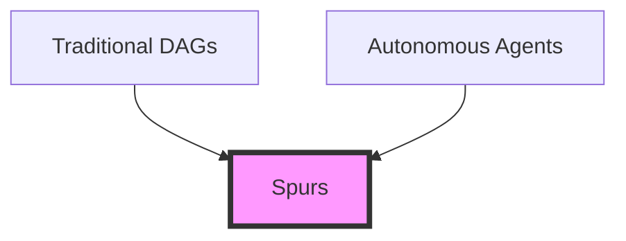
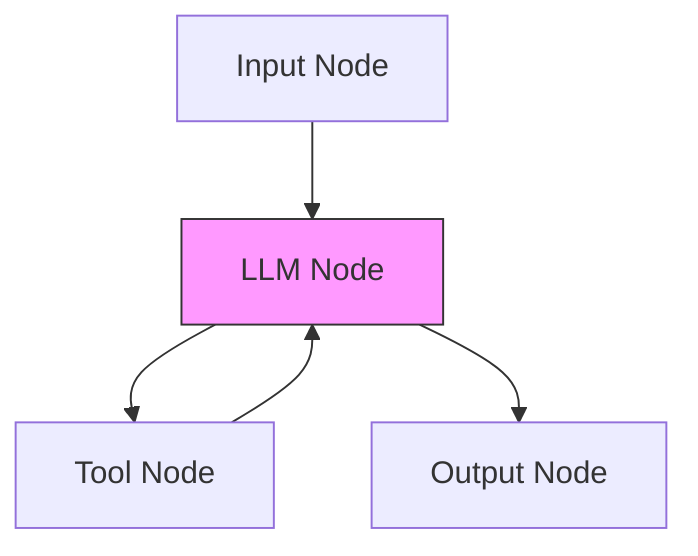
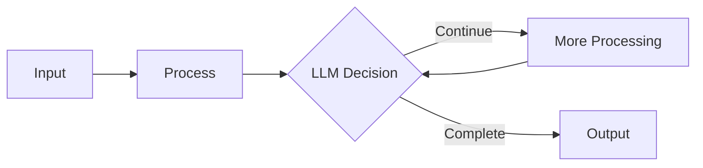

import { Callout } from 'nextra/components'

## What are Spurs?

Spurs are AI-native, dynamic workflow graphs that bridge the gap between traditional workflows and autonomous agents. Think of them as the cool middle child in the automation family - more flexible than their rigid DAG siblings, but more structured than their free-spirited agent cousins.



### Visual Overview



## Why Spurs?

### Beyond Traditional DAGs

Traditional workflow systems are like trains on tracks - they follow predetermined paths and can't deviate. But real-world problems often require more flexibility. What if your workflow needs to:
- Decide its next step based on AI analysis?
- Loop through a process until a condition is met?
- Dynamically choose which tools to use?

This is where Spurs shine. They combine the reliability of structured workflows with the adaptability of AI.

### The Power of AI-Native Workflows

Spurs are built from the ground up with AI in mind. Unlike traditional DAGs that can only flow in one direction, Spurs can:
- Create cycles where LLM agents call themselves repeatedly
- Dynamically decide execution paths
- Integrate seamlessly with AI tools and services

<Callout type="info">
While traditional workflows say "do this, then that", Spurs say "analyze this, decide what to do next, and keep going until you achieve the goal."
</Callout>

## Building Blocks

### Nodes: The Foundation

Spurs are composed of nodes - modular, typed functions that serve as building blocks. Each node can:
- Process inputs and produce outputs
- Make decisions about workflow continuation
- Interact with external services
- Execute AI operations

For a detailed explanation of nodes, check out our [Nodes documentation](/essentials/nodes).

### Execution Model

The execution engine behind Spurs is asynchronous and intelligent:
- Nodes run as soon as their dependencies are satisfied
- Multiple nodes can execute in parallel
- The execution path can change dynamically based on LLM decisions
- Cycles are handled gracefully, allowing for iterative processing



## Creating Your First Spur

You have three paths to create Spurs, choose the one that best fits your workflow:

### 1. Visual UI Builder
Perfect for visual thinkers and rapid prototyping:
```python
# No code needed! Just drag, drop, and connect nodes
```

### 2. Python Package
For those who prefer programmatic control:
```python
from pyspur import Spur, Node

spur = Spur()
spur.add_node(Node.input("user_query"))
spur.add_node(Node.llm("analysis"))
spur.add_node(Node.tool("web_search"))
```

### 3. JSON Structure
For infrastructure-as-code and version control:
```json
{
  "nodes": [
    {"type": "input", "id": "query"},
    {"type": "llm", "id": "analysis"},
    {"type": "tool", "id": "search"}
  ],
  "edges": [...]
}
```

<Callout type="warning">
Remember: With great power comes great responsibility. While Spurs can create cycles, make sure they have clear termination conditions to avoid infinite loops!
</Callout>

## Advanced Concepts

### Cyclic Workflows

Unlike traditional DAGs, Spurs embrace cycles. This enables powerful patterns like:
- Iterative refinement of results
- Recursive problem solving
- Dynamic tool selection and usage

### Dynamic Execution

The async execution engine ensures optimal performance:
```python
# Behind the scenes in workflow_executor.py
async def execute_node(self, node_id: str):
    # Run nodes as soon as dependencies are satisfied
    # No waiting for the entire level to complete!
```

<Callout type="info">
Think of Spurs as a jazz band rather than an orchestra - each node can improvise and play its part when ready, while still maintaining harmony with the overall piece.
</Callout>
